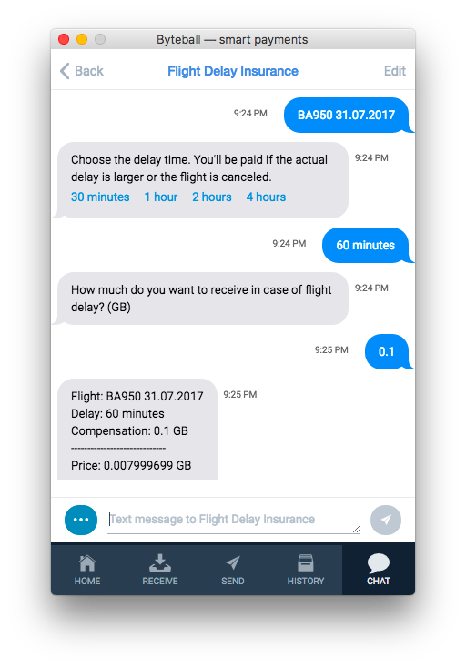

# Flight delay insurance

This chatbot sells insurance against flight delays.  When a customer wants to receive a compensation `C` in case his future flight is delayed, the customer pays `x% C` premium, the bot pays `(100% - x%) C`, and the entire amount `C` is locked on a smart contract.  After the outcome is known and posted by [Flight delays oracle](https://github.com/byteball/flight-delays-oracle), the customer or the bot unlock the contract and sweep the entire amount `C`.



The quotes are based on ratings provided by Flightstats: https://developer.flightstats.com/api-docs/ratings/v1.

## Install

Install node.js 4+, clone the repository, then say
```sh
npm install
```
## Run
```sh
node insurance.js
```
The first time you run the script, it will give you instructions for initial setup.
